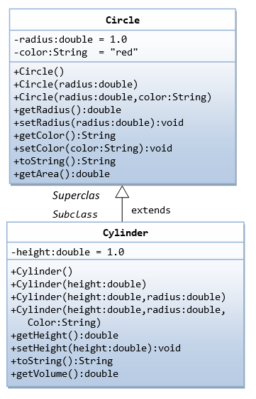

# Overridding dei metodi - esempio Circle a Cylinder

  

La classe `it.esempio.uno.Cylinder` utilizza il metodo `getArea()` ereditato da `Circle` che calcola l'area del cerchio (la base del cilindro).

Vogliamo che l'area del `Cylinder` dia invece la superficie del cilindro: quindi 2 volte l'area delle basi + l'area della fascia laterale.

Sotto il package `it.esempio.due` abbiamo la nuova versione della sottoclasse `Cylinder` con l'override del metodo `getArea()` rispetto alla versione ereditatta dalla classe `Circle`.

In `it.esempio.due.Cylinder` quindi aggiungiamo il metodo `getArea()`:

```java

   @Override
   public double getArea() {
      return 2 * Math.PI * getRadius() * height + 2 * super.getArea();
   }
   
``` 
Si vede che è stato necessario utilizzare `super.getArea()` per ottenere l'area della base del cerchio, utilizzando la versione del metodo `getArea()` del `Circle`.
  
Da notare che è necessaria anche la modifica di  `getVolume()` in `it.esempio.due.Cylinder` con l'utilizzo di `super.getArea()` per richiamare il `getArea()` di `Circle`:

```java
   // Need to change the getVolume() as well
   public double getVolume() {
      return super.getArea() * height;   // use superclass' getArea()
   }
```

## Esecuzione `it.esempio.uno.TestCylinder`

Utilizza `it.esempio.uno.Cylinder`   

Output esecuzione:
```
Radius is 1.0 Height is 1.0 Color is red Base area is 3.141592653589793 Volume is 3.141592653589793  
Radius is 2.0 Height is 5.0 Color is red Base area is 12.566370614359172 Volume is 62.83185307179586
```

## Esecuzione `it.esempio.due.TestCylinder`

Utilizza `it.esempio.due.Cylinder`  

Output esecuzione: 
```
Radius is 1.0 Height is 1.0 Color is red Area is 12.566370614359172 Volume is 3.141592653589793
Radius is 2.0 Height is 5.0 Color is red Area is 87.96459430051421 Volume is 62.83185307179586 
```